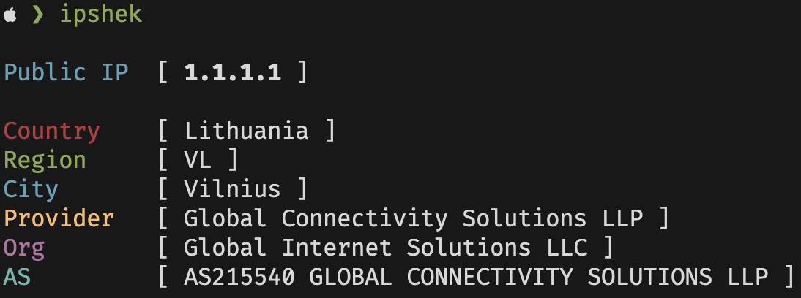

# goipshek
Check your or other IP fast via CLI
 


#### Feel free to contribute! 
 
## Install
#### Fastest way 
Just run this command in terminal and it will install everything itself
```sh
curl -L https://sh.fynjirby.dev/goipshek | sh
```
or if you prefer GoLang package manager use
```sh
go install github.com/fynjirby/goipshek@latest
```
#### Manual way
Go to [releases](https://github.com/Fynjirby/goipshek/releases/) and download latest binary for your OS, then move it to `/usr/local/bin/` and enjoy with simple `goipshek` in terminal! (You can rename the binary btw)

## Building
- Install [Go](https://go.dev/) and make sure it's working with `go version`
- Clone repo
- Run `go build` in repo directory, then move it to `/usr/local/bin/`

## Usage
`ipshek` to see your IP info
<br><br>
`ipshek [ip]` to see provided IP info (example `ipshek google.com` or `ipshek 1.1.1.1`)
